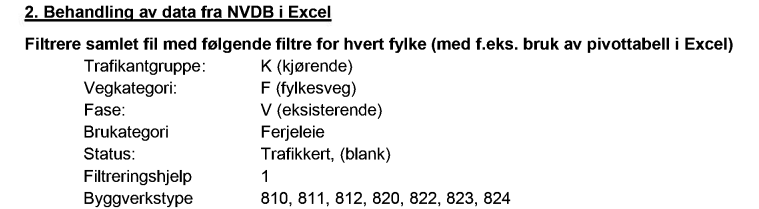

# Generelle betraktninger

Rutinen med at samferdselsdepartementet "bestiller" via formelle brev til vegdirektoratet og derfra til SVV avdelig "Transport og samfunn" gir veldig stor avstand mellom behov og utfører. Dette er uheldig og inviterer til misforståelser. I stedet anbefaler vi å gjennomføre felles workshop eller tilsvarende, der vi får avklart felles begreper og diskutert uklarheter i bestilling, datainnhold og så videre.

# Uklarheter og tvetydigheter 

Vi på fagsiden som gjør datauttrekket fra NVDB og Brutus har et par spørsmål som aller helst bør avklares i workshop eller lignende. 

### Filtrering ferjekaibru 

I følge [Viaonva-oppskriften fra 2021](https://www.regjeringen.no/contentassets/e8645ebe0e02470da89253caef0addba/rapport-forenklet-modell-til-kriteriet-for-utgiftsbehov-ti1405835.pdf) så skal datagrunnlaget for ferjekai og tilleggskai 
skaffes ved nedlasting av objekttype _60 Bru_ fra NVDB med dette vegnettsfilteret: 
  * `trafikantgruppe = K` (kjørende)
  * `vegkategori = F` (Fylkesveg)
  * `fase = V` (eksisterende veg)

og disse egenskapsfiltrene 
  * `Brukategori = Ferjeleie`
  * `Status = Trafikkert` eller `<null>` (blank)
  * `Byggverkstype` = en av typene 
    - `Ferjekaibru (810)`
    - `Ferjekaibru (811)`
    - `Ferjekaibru (812)`
    - `Kai (820)`
    - `Tilleggskai (822)`
    -  `Tilleggskai (823)`
    -  `Tilleggskai (824)`

Etter denne oppskriften skal yggverkstype altså IKKE være blant typene _Kai/bev.bru (8), Kai/bev.bru (80), Kai/bev.bru (800), Ferjekaibru (81), Reservekaibru (813), Ferjekaibru (819), 
Tilleggskai (821), Sekundærkai (825), Liggekai (826), Liggekai (827)_ eller  _Ro-Ro-rampe (828_, for å nevne noen av byggverkstypene som er definert i [datakatalogen](https://datakatalogen.atlas.vegvesen.no/#/60/Bru) og har ordet _"kai"_ eller "_ferje"_ i navnet. 

> Hva er grunnen til at varianten `Tilleggskai (821)` ikke skal være med i datauttaket når variantene `(822), (823)` og `(824)` skal være med? Skyldes dette tilfeldigheter når man konstruerte eksemplet (f.eks laget eksempel på datauttak for et fylke der 821-varianten ikke fantes?), eller ligger det en dypere vurdering bak? 

Skjermbilde fra [Viaonva-oppskriften fra 2021](https://www.regjeringen.no/contentassets/e8645ebe0e02470da89253caef0addba/rapport-forenklet-modell-til-kriteriet-for-utgiftsbehov-ti1405835.pdf) 

I praksis har vi ikke tatt hensyn til denne oppskriften for uttak av ferjekaier fra NVDB, men latt Brutus fagmiljøet (som kjenner datagrunnlaget best) avgjøre hvilke tillegskaier og ferjekaier som skal inkluderes i datagrunnlaget. 

### Vegnett som er ferjer

Skal vi ekskludere det vegnettet som er bilferje når vi gjør opptelling av veglengder? 

### Gang- og sykkelvegbruer

Gang- og sykkelvegbruer skal driftes de også. Er det riktig eller feil å inkludere gang- og sykkelvegbruer i dataleveransen? 